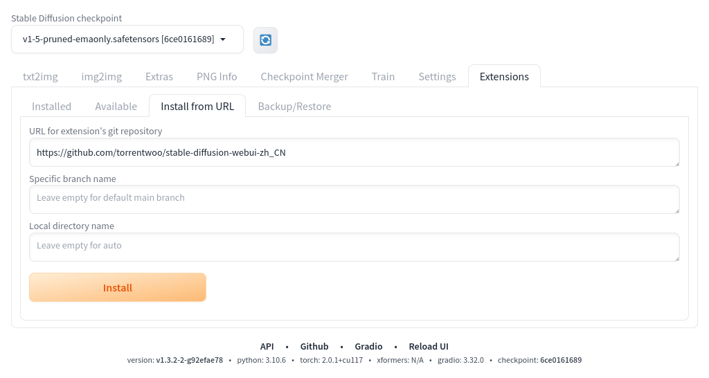
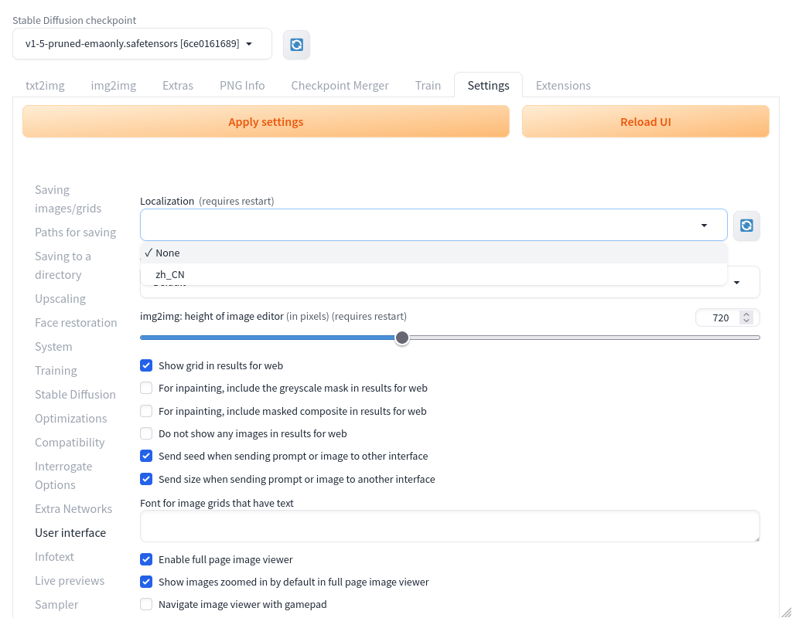
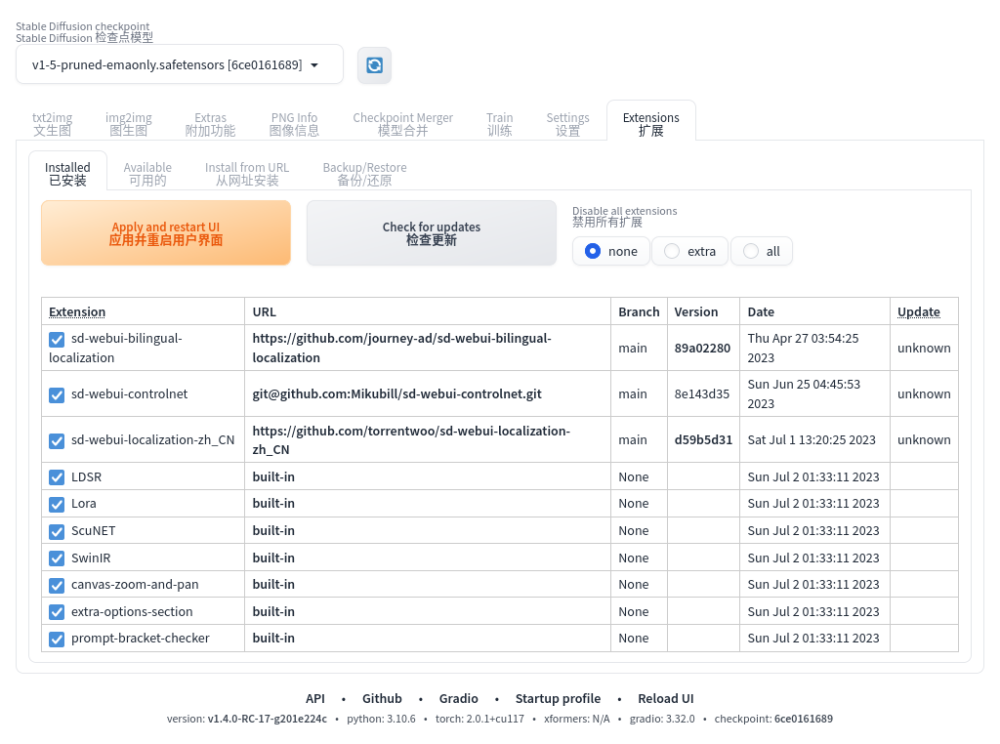
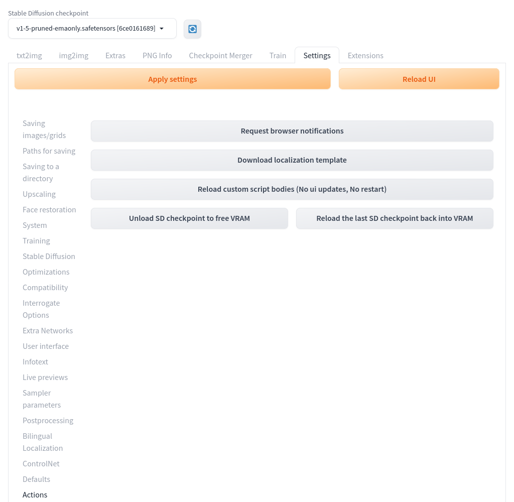

# [Stable Diffusion web UI](https://github.com/AUTOMATIC1111/stable-diffusion-webui) 简体中文翻译

## 安装

1. 首先点击 `Stable Diffusion web UI` 的 `Extensions` 选项卡，切换到扩展管理界面；
2. 然后选择 `Install from URL` 二级选项卡，定位到从网址安装表单；
3. 再将 `https://github.com/torrentwoo/sd-webui-localization-zh_CN` （即本仓库网址）填入到 `URL for extension's git repository` 表单项内；
4. 其余表单项可以留空；
5. 最后，点击 `Install` 按钮进行安装，并等待安装过程完成即可。

## 使用

鉴于 `Stable Diffusion web UI` 有着众多的专业术语，为了不让本人蹩脚的翻译导致您误解原意，推荐您搭配 **双语对照** 功能使用。

### 双语对照

- 移步 [journey-ad/sd-webui-bilingual-localization](https://github.com/journey-ad/sd-webui-bilingual-localization) 安装该扩展
- 遵照其 [使用指南](https://github.com/journey-ad/sd-webui-bilingual-localization/blob/main/README_ZH.md) 配置双语翻译

### 仅简体中文

如果您更倾向于使用单独的简体中文翻译，那么在您安装完本翻译扩展后，按以下步骤配置您的 `Stable Diffusion web UI`

1. 通过点击顶部的 `Settings` 选项卡，切换到配置界面；
2. 然后在左侧找到并点击 `User interface` 项，定位到用户界面；此时您将看到 `Localization (requires restart)` 本地化配置项；
3. 点击上述配置项旁边的 *刷新* 图标，让 `Stable Diffusion web UI` 加载之前安装的语言翻译文件；
4. 再从上述配置项的下拉列表中选择 `zh_CN` 项；
5. 回到顶部，点击 `Apply settings` 按钮应用您刚才的更改；
6. 最后，点击 `Reload UI` 按钮，等待 `Stable Diffusion web UI` 界面重新加载以应用汉化翻译。

### 更新本地翻译

如果要更新本地翻译文件，请按以下步骤进行：

1. 通过点击顶部的 `Extensions` 选项卡，切换到扩展管理界面；
2. 确保二级选项卡位于 `Installed` 已安装扩展页面；
3. 然后点击 `Check for updates` 检查更新按钮进行更新检查（需要畅通的网络）；
4. 当表格的 `Update` 更新状态列有可选变化时，表示它有更新可用；
5. 再点击 `Apply and restart UI` 应用并重启用户界面按钮进行更新；
6. *请注意：要完成更新过程，可能需要多次重启用户界面（至少我遇到过）。*

**提示：**
1. 如果您只想更新翻译文件，请在上图下方的 `Extension` 扩展列表里，勾选 `sd-webui-localization-zh_CN`，并取消勾选其他已安装的扩展，就可以只检查和更新语言翻译；
2. 如果您成功更新过翻译，请适时的刷新本地缓存以使更新生效。使用 `Ctrl+F5` 组合按键可予以刷新缓存。

## 贡献翻译

`Stable Diffusion web UI` 另有众多扩展，本人无法逐一体验并翻译，因此汉化会存在遗漏。如果您也对汉化它们有兴趣和完善，欢迎您贡献您的翻译。

### 关于翻译的书写

在翻译时，不免会遇到中文、数字、原生语言文字混杂的情形，为了规范翻译的可读性，在您贡献翻译前，请阅读：

- [中文文案排版指北](https://github.com/sparanoid/chinese-copywriting-guidelines)
- [中文写作风格指南](https://github.com/richardchien/chinese-writing-style-guide)
- [中文写作排版风格指南](https://github.com/RightCapitalHQ/chinese-style-guide)

### 如何提取翻译模板

1. 通过点击顶部的 `Settings` 选项卡，切换到配置界面；
2. 在左侧找到并点击 `Actions` 项，定位到操作界面；
3. 再点击 `Download localization template` 按钮，会得到一份 `localization.json` 文件；
4. `localization.json` 文件便是翻译模板，它包含了您当前使用的 `Stable Diffusion web UI` 的语言模板；
5. 另外在 `stable-diffusion-webui/javascript` 目录下的 `*hints.js` 文件内包含了部分上述步骤无法提取的语句。

